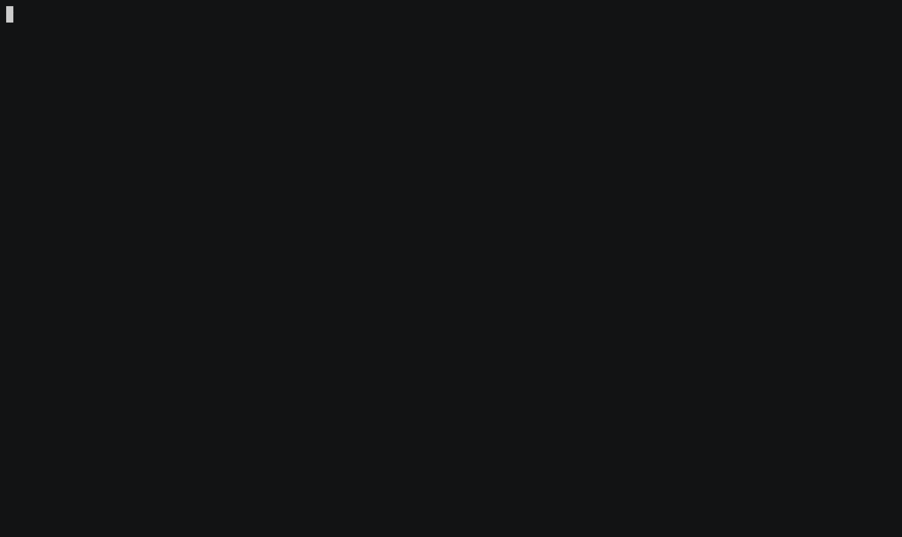

# BSFL

The Bash Shell Function Library (BSFL) is a small bash script that acts as a library for bash scripts. It provides a couple of functions that makes the lives of most people using shell scripts a bit easier.

This project is a fork of the original work of Louwrentius.

## Getting started

In order to use BSFL, you have to include the library in your bash scripts. You can do it with an absolute path:

    source <absolute path to BSFL>

For example:

    source /opt/bsfl/bsfl.sh

Or with a relative path:

    declare -r DIR=$(cd "$(dirname "$0")" && pwd)
    source $DIR/<relative path to BSFL>

For example:

    declare -r DIR=$(cd "$(dirname "$0")" && pwd)
    source $DIR/../lib/bsfl.sh

## What's next?

The best way to learn how BSFL works is to look at the examples available in the [examples][examples] folder.

## Documentation

The online documentation is available [here][bsfl doc].

Building the documentation is done by using [Doxygen][doxygen]:

    cd <BSFL repository>/doc
    git submodule update --init --recursive
    doxygen Doxyfile

## Dependencies

BSFL is implemented for bash version 4. Prior versions of bash will fail at interpreting its code.

In addition, BSFL depends of some external programs. Here is the list of these programs:

* date
* grep
* logger
* printf
* tput
* tr

However, we try to get as much as possible a standalone library. Hence, some of these external dependencies will be removed in the future.

## Unit tests

BSFL uses [Bats][bats] testing framework to verify the correct behaviour of its functions.

To run all the tests:

    bats <BSFL repository>/test

Or, to run only the tests of a specific group:

    bats <BSFL repository>/test/<test file>

For example, for the network group:

    bats <BSFL repository>/test/network.bats

## Releasing a new version

Below are the different steps to do before releasing a new version:

* Run all tests and be sure they all pass
* Update the `BSFL_VERSION` variable in `lib/bsfl.sh`
* Update the `PROJECT_NUMBER` variable in `doc/Doxygen`
* Update the `Version` variable in `bsfl.spec`
* Update `README.md` if needed

## Get involved!

This project is still under development. Contributions are welcomed.

## License

[New BSD][new bsd]

 [bats]: https://github.com/sstephenson/bats
 [bsfl doc]: http://skyplabs.github.io/bsfl
 [doxygen]: http://doxygen.org/
 [examples]: https://github.com/SkypLabs/bsfl/tree/master/examples
 [new bsd]: http://opensource.org/licenses/BSD-3-Clause
